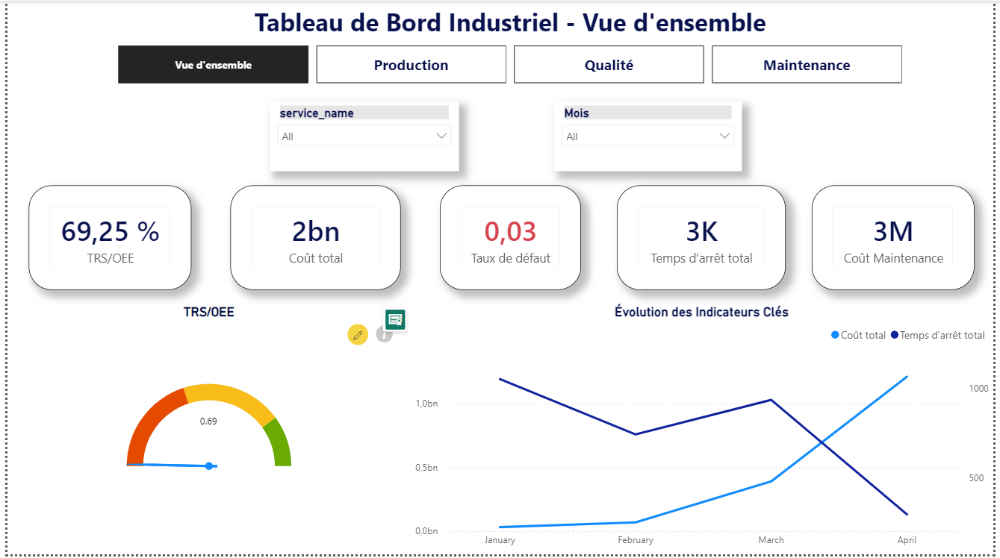
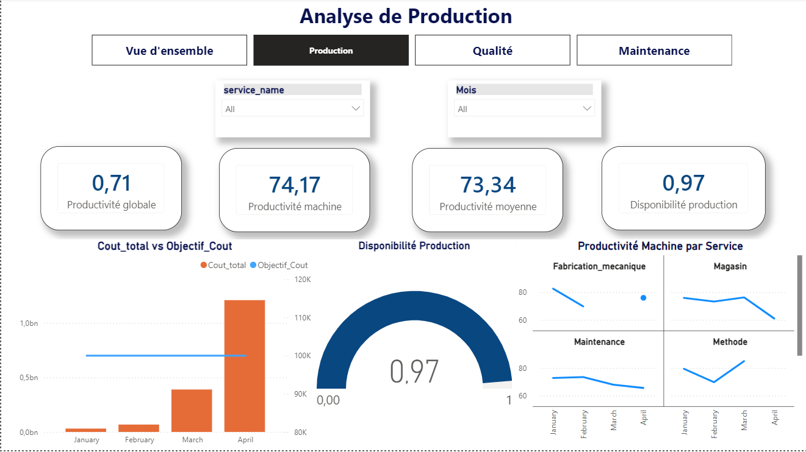
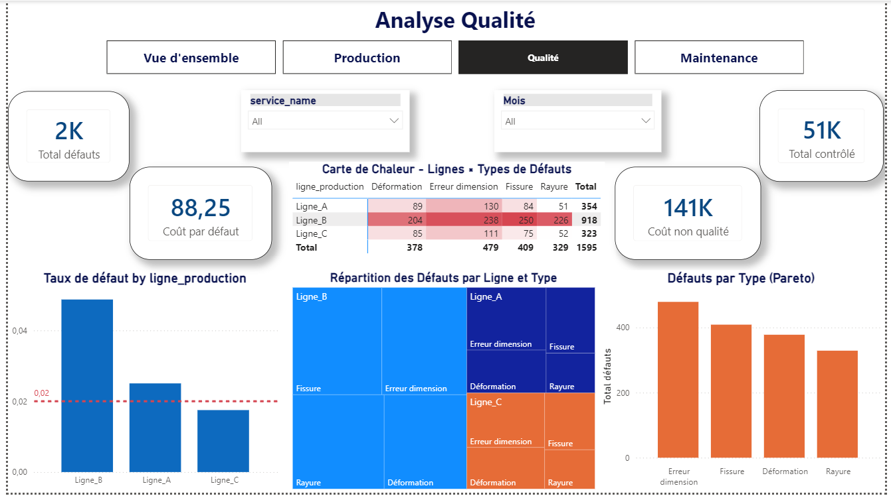
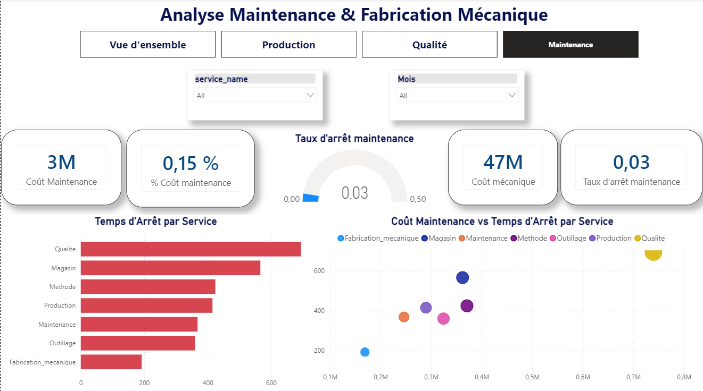

# Tableau de Bord Industriel - Power BI

Un tableau de bord interactif de 4 pages analysant les performances industrielles d'une usine a travers 4 axes : Production, Qualite, Maintenance et Fabrication Mecanique.

---

## Structure du projet

DAX/
measures_industriel.md
Screenshots/
page1_vue_ensemble.png
page2_production.png
page3_qualite.png
page4_maintenance.png
Projet power bi.pbix
README.md

---

## Pages du tableau de bord

### 1. Vue d'ensemble
Vue globale de la sante de l'usine en un coup d'oeil.
- KPI cards : Cout total, TRS/OEE, Taux de defaut, Temps d'arret total, Cout Maintenance
- Jauge dynamique : TRS/OEE avec min/max dynamiques (minTRS / maxTRS)
- Graphique en courbes : Evolution des indicateurs cles par mois
- Formatage conditionnel : Taux de defaut en rouge si superieur a la cible 2%

---

### 2. Analyse de Production
Focus sur l'efficacite et les couts de production.
- KPI cards : Productivite globale, Productivite machine, Productivite moyenne, Disponibilite production
- Graphique combine : Cout total vs Objectif (barres + ligne de reference)
- Petits multiples : Productivite machine par service (grille comparative)
- Jauge : Disponibilite production

---

### 3. Analyse Qualite
Page la plus avancee - analyse des causes racines des defauts.
- KPI cards : Total defauts, Total controle, Cout non qualite, Cout par defaut
- Graphique Pareto : Defauts par type tries par ordre decroissant
- Carte de chaleur (Heatmap) : Matrice Ligne_production x Type de defaut
- Treemap : Repartition des defauts par ligne et type
- Graphique a barres : Taux de defaut par ligne avec ligne cible CIBLEQ (2%)

---

### 4. Maintenance et Fabrication Mecanique
Analyse des couts et temps d'arret maintenance.
- KPI cards : Cout Maintenance, % Cout maintenance, Taux d'arret maintenance, Cout mecanique
- Jauge : Taux d'arret maintenance
- Nuage de points : Cout Maintenance vs Temps d'arret par service
- Graphique a barres horizontales : Temps d'arret total par service

---

## Modele de donnees

| Table | Description |
|---|---|
| fact_industriel | Table de faits principale - 100 lignes |
| fact_qualite | Donnees qualite - 100 lignes |
| dim_service | 7 services |
| Dim_date | 2024, janvier a avril |

---

## Mesures DAX principales

### INDICATEURS MAINTENANCE
| Mesure | Formule |
|---|---|
| Cout Maintenance | SUM(fact_industriel[cout_maintenance]) |
| Cout total | SUM(fact_industriel[cout_total]) |
| % Cout maintenance | DIVIDE([Cout Maintenance], [Cout total], 0) |
| Temps d'arret total | SUM(fact_industriel[temps_arret]) |
| Taux d'arret maintenance | DIVIDE([Temps d'arret total], SUM(fact_industriel[heures_travail]), 0) |

### INDICATEURS PRODUCTION
| Mesure | Formule |
|---|---|
| Cout_total | SUM(fact_industriel[cout_total]) |
| Objectif_Cout | 100000 |
| Taux_Cout | DIVIDE([Cout_total], [Objectif_Cout]) |
| Disponibilite production | DIVIDE([Temps utile], SUM(fact_industriel[heures_travail]), 0) |
| Productivite globale | [Disponibilite production] * DIVIDE([Taux utilisation machine], 100, 0) |
| Productivite moyenne | AVERAGE(fact_industriel[taux_utilisation_machine]) |

### INDICATEURS QUALITE
| Mesure | Formule |
|---|---|
| Total defauts | SUM(fact_qualite[nb_defauts]) |
| Total controle | SUM(fact_qualite[nb_pieces_controlees]) |
| Taux de defaut | DIVIDE([Total defauts], [Total controle], 0) |
| Cout non qualite | SUM(fact_qualite[cout_non_qualite]) |
| CIBLEQ | 0.02 |
| coleur_tauxDefaut | IF([Taux de defaut] > [CIBLEQ], "RED", "GREEN") |

### INDICATEURS FABRICATION MECANIQUE
| Mesure | Formule |
|---|---|
| TRS/OEE | Disponibilite x Performance x Qualite |
| Cout mecanique | CALCULATE(SUM(fact_industriel[cout_total]), dim_service[service_name] = "Fabrication_mecanique") |

---

## Technologies utilisees

- Power BI Desktop
- DAX (Data Analysis Expressions)
- Power Query (M)

---

## Auteur

Yassir Bouchnaf Etudient en BUISINESS AND DATA MANAGEMENT
Projet realise dans le cadre d'un cours Power BI - Juin 2026
